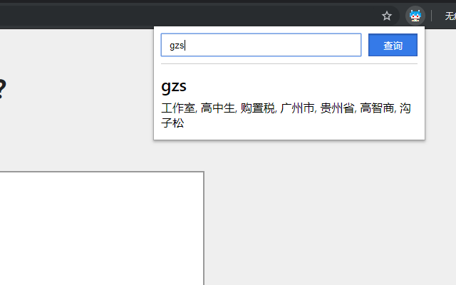

# nbnhhsh-crx
Chrome Extension for nbnhhsh 能不能好好说话Chrome插件版

原作者与后台服务提供: [@itorr](https://github.com/itorr)
原版：https://github.com/itorr/nbnhhsh

## Usage

点开拓展弹出框

输入任意想要查询的内容或者在页面上选中任意想要翻译的文本后打开拓展程序

仅支持英文字符输入

## 油猴脚本

- [https://greasyfork.org/zh-CN/scripts/398555](https://greasyfork.org/zh-CN/scripts/398555)
